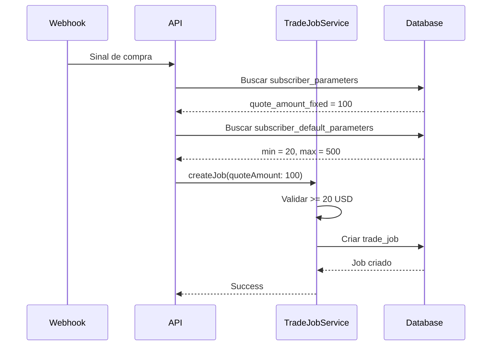
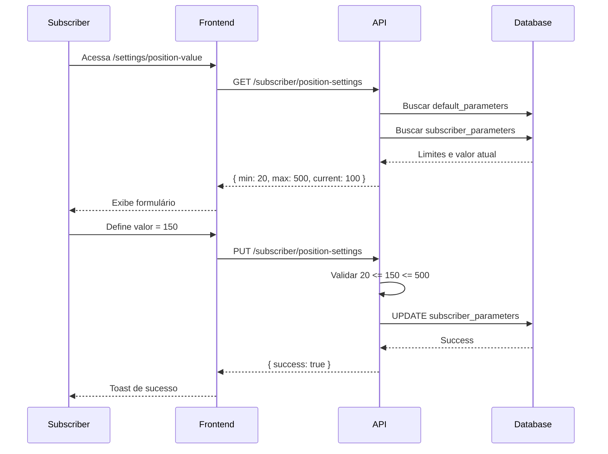

# Módulo de Assinantes

## Visão Geral

O módulo de assinantes permite gerenciar usuários que utilizam o sistema através de um plano de assinatura. Os assinantes têm acesso restrito ao sistema, com funcionalidades específicas e parâmetros configurados pelo administrador.

## Arquitetura

```
┌─────────────────────────────────────────────────────────────┐
│                     ADMIN DASHBOARD                         │
├─────────────────────────────────────────────────────────────┤
│  • Lista de Assinantes                                      │
│  • Parâmetros Padrão Globais (limites min/max, SL/TP/SG)    │
│  • Parâmetros por Assinante                                 │
│  • Webhooks Padrão                                          │
│  • Posições de Assinantes                                   │
│  • Operações de Assinantes                                  │
│  • Mapa de Calor de Assinantes                              │
│  • Monitor SL/TP de Assinantes                              │
└─────────────────────────────────────────────────────────────┘
                           │
                           ▼
┌─────────────────────────────────────────────────────────────┐
│              SUBSCRIBER DEFAULT PARAMETERS                   │
│  (Tabela: subscriber_default_parameters)                    │
├─────────────────────────────────────────────────────────────┤
│  • min_quote_amount: 20 USD (mínimo obrigatório)            │
│  • max_quote_amount: null (sem limite) ou valor definido    │
│  • default_quote_amount: 100 USD                            │
│  • default_sl/tp/sg/tsg_enabled e porcentagens              │
│  • min_profit_pct                                           │
│  • lock_webhook_on_tsg                                      │
└─────────────────────────────────────────────────────────────┘
                           │
                           ▼
┌─────────────────────────────────────────────────────────────┐
│                 SUBSCRIBER PARAMETERS                        │
│  (Tabela: subscriber_parameters - por usuário)              │
├─────────────────────────────────────────────────────────────┤
│  • user_id: ID único do assinante                           │
│  • quote_amount_fixed: valor escolhido pelo assinante       │
│  • Outros parâmetros específicos do assinante               │
└─────────────────────────────────────────────────────────────┘
                           │
                           ▼
┌─────────────────────────────────────────────────────────────┐
│                  SUBSCRIBER DASHBOARD                        │
├─────────────────────────────────────────────────────────────┤
│  Menu restrito:                                             │
│  • Contas (próprias)                                        │
│  • Mapa de Calor (próprias posições)                        │
│  • Monitor SL/TP (próprias posições)                        │
│  • Relatórios                                               │
│  • Valor da Posição (configuração do valor de ordem)        │
│  • Meu Plano                                                │
└─────────────────────────────────────────────────────────────┘
```

## Funcionalidades

### 1. Parâmetros Padrão Globais

Configurações aplicadas a todos os assinantes:

- **Limites de Valor**:
  - `min_quote_amount`: Valor mínimo por ordem (padrão: $20 USD)
  - `max_quote_amount`: Valor máximo por ordem (null = sem limite)
  - `default_quote_amount`: Valor padrão quando não configurado

- **Proteções de Posição**:
  - Stop Loss (SL): Porcentagem de perda máxima
  - Take Profit (TP): Porcentagem de lucro para venda
  - Stop Gain (SG): Ativação e queda para venda
  - Trailing Stop Gain (TSG): Ativação dinâmica

- **Configurações Gerais**:
  - `min_profit_pct`: Lucro mínimo antes de venda
  - `lock_webhook_on_tsg`: Bloquear webhook quando TSG ativo

### 2. Menu do Assinante

Assinantes têm acesso restrito às seguintes páginas:

| Página | Descrição |
|--------|-----------|
| Dashboard | Visão geral de posições e performance |
| Contas | Gerenciar contas de exchange (apenas modo REAL) |
| Mapa de Calor | Visualizar posições abertas com cores PnL |
| Relatórios | Gerar relatórios de performance |
| Valor da Posição | Configurar valor padrão de ordens |
| Meu Plano | Ver detalhes da assinatura |

**Páginas não disponíveis para assinantes:**
- Monitor SL/TP (gerenciado pelo admin)
- Webhooks (configurados pelo admin)
- Parâmetros de trading (definidos pelo admin)

### 3. Configuração de Valor da Posição

O assinante pode configurar seu próprio valor de ordem, respeitando os limites:

1. Admin define: `min_quote_amount = 20`, `max_quote_amount = 500`
2. Assinante acessa `/settings/position-value`
3. Assinante escolhe valor entre $20 e $500
4. Valor é salvo em `subscriber_parameters.quote_amount_fixed`
5. Ordens de compra usam esse valor

### 4. Validação Global de Mínimo

Todas as ordens de compra (para qualquer usuário) são validadas:

```typescript
const MIN_QUOTE_AMOUNT_USD = 20;
if (dto.side === 'BUY' && quoteAmount < MIN_QUOTE_AMOUNT_USD) {
  throw new Error(`Valor mínimo por ordem: $${MIN_QUOTE_AMOUNT_USD} USD`);
}
```

## API Endpoints

### Admin - Parâmetros Padrão

```
GET  /admin/subscribers/default-parameters
PUT  /admin/subscribers/default-parameters
```

### Admin - Heatmap e Monitor

```
GET  /admin/subscribers/heatmap
GET  /admin/subscribers/monitoring-tp-sl
```

### Admin - Posições e Operações

```
GET  /admin/subscribers/positions
GET  /admin/subscribers/positions/:id
PUT  /admin/subscribers/positions/bulk-update
GET  /admin/subscribers/operations
GET  /admin/subscribers/operations/:id
```

### Subscriber - Configurações

```
GET  /subscriber/position-settings
PUT  /subscriber/position-settings
GET  /subscriber/dashboard
```

## Banco de Dados

### Tabela: subscriber_default_parameters

```sql
CREATE TABLE subscriber_default_parameters (
    id INT PRIMARY KEY AUTO_INCREMENT,
    min_quote_amount DECIMAL(36, 18) DEFAULT 20,
    max_quote_amount DECIMAL(36, 18) NULL,
    default_quote_amount DECIMAL(36, 18) DEFAULT 100,
    default_sl_enabled BOOLEAN DEFAULT false,
    default_sl_pct DECIMAL(5, 2) NULL,
    default_tp_enabled BOOLEAN DEFAULT false,
    default_tp_pct DECIMAL(5, 2) NULL,
    default_sg_enabled BOOLEAN DEFAULT false,
    default_sg_pct DECIMAL(5, 2) NULL,
    default_sg_drop_pct DECIMAL(5, 2) NULL,
    default_tsg_enabled BOOLEAN DEFAULT false,
    default_tsg_activation_pct DECIMAL(5, 2) NULL,
    default_tsg_drop_pct DECIMAL(5, 2) NULL,
    min_profit_pct DECIMAL(5, 2) NULL,
    lock_webhook_on_tsg BOOLEAN DEFAULT true,
    created_at DATETIME DEFAULT CURRENT_TIMESTAMP,
    updated_at DATETIME
);
```

### Tabela: subscriber_parameters (atualização)

```sql
ALTER TABLE subscriber_parameters 
ADD COLUMN quote_amount_fixed DECIMAL(36, 18) NULL;
```

## Fluxo de Dados

### Criação de Ordem



### Configuração de Valor pelo Assinante



## Restrições de Assinantes (v1.10.0)

### Modo de Operação

Assinantes operam **exclusivamente em modo REAL**:
- Toggle de modo (Real/Simulation) é oculto para assinantes
- Cadastro de contas permite apenas modo REAL
- Todas as operações são executadas em ambiente real

### Limite de Contas

O plano de assinatura define o número máximo de contas:
- Validação no frontend ao adicionar conta
- Validação no backend ao criar conta
- Botão "Adicionar Conta" desabilitado quando limite atingido

### Símbolos Permitidos

O admin pode restringir quais pares de trading o assinante pode operar:
- Configurado em `/subscribers-admin/default-parameters`
- Campo `symbols` com lista separada por vírgula (ex: `BTCUSDT,SOLUSDT,BNBUSDT`)
- Webhooks são filtrados pelo símbolo antes de criar ordens

### Sincronização de Webhooks

Botão "Sincronizar Assinantes" em `/subscribers-admin/webhooks`:
- Vincula webhooks padrão a novos assinantes
- Cria parâmetros padrão se não existirem
- **Não sobrescreve** `quote_amount_fixed` já configurado pelo assinante

### Filtro de Assinantes com Busca

Nas páginas de admin de assinantes:
- Select de assinante com busca por email
- Filtragem em tempo real enquanto digita
- Páginas: posições, operações, heatmap, parâmetros

## Segurança

### Controle de Acesso

- Endpoints `/admin/*` requerem role `ADMIN`
- Endpoints `/subscriber/*` requerem role `subscriber`
- Frontend filtra menu baseado nas roles do usuário

### Validações

1. **Backend**:
   - Validação de mínimo/máximo no controller
   - Validação de mínimo global no TradeJobService
   - Guards de autenticação e autorização

2. **Frontend**:
   - Validação de limites no formulário
   - Menu restrito por role
   - Redirecionamento se acesso não autorizado

## Arquivos Relacionados

### Backend

- `packages/db/prisma/schema.prisma` - Modelos do banco
- `apps/api/src/admin/admin-system.controller.ts` - Endpoints admin
- `apps/api/src/subscriber/subscriber.controller.ts` - Endpoints assinante
- `packages/domain/src/trading/trade-job.service.ts` - Validação de mínimo

### Frontend

- `apps/frontend/src/components/layout/Sidebar.tsx` - Menu restrito
- `apps/frontend/src/lib/api/admin.service.ts` - Serviço API admin
- `apps/frontend/src/lib/api/subscriber.service.ts` - Serviço API assinante
- `apps/frontend/src/app/(dashboard)/subscribers-admin/*` - Páginas admin
- `apps/frontend/src/app/(dashboard)/settings/position-value/page.tsx` - Página assinante

## Migrations

### 20251218100000_add_subscriber_default_parameters

```sql
-- Criar tabela de parâmetros padrão
CREATE TABLE subscriber_default_parameters (...);

-- Adicionar coluna em subscriber_parameters
ALTER TABLE subscriber_parameters 
ADD COLUMN quote_amount_fixed DECIMAL(36, 18) NULL;

-- Inserir registro padrão
INSERT INTO subscriber_default_parameters (min_quote_amount, ...) 
VALUES (20, ...);
```

## Testes

### Testes Manuais Recomendados

1. **Admin - Parâmetros Padrão**:
   - Acessar `/subscribers-admin/default-parameters`
   - Definir min = 50, max = 200
   - Salvar e verificar persistência

2. **Assinante - Valor da Posição**:
   - Login como assinante
   - Acessar `/settings/position-value`
   - Tentar valor < mínimo (deve falhar)
   - Tentar valor > máximo (deve falhar)
   - Definir valor válido (deve funcionar)

3. **Criação de Ordem**:
   - Enviar webhook de compra
   - Verificar se valor configurado foi usado
   - Verificar validação de mínimo $20

4. **Menu Restrito**:
   - Login como assinante
   - Verificar que apenas itens permitidos aparecem
   - Tentar acessar URL bloqueada (deve redirecionar)

